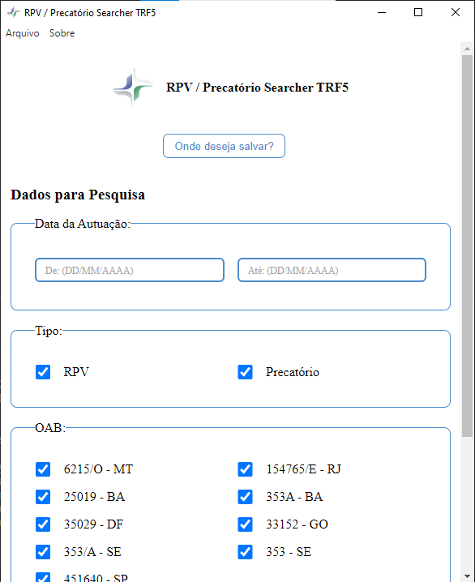

# Aplicação Electron - RPV Search

<div align="center">
    
</div>

### Descrição
Esta aplicação, desenvolvida utilizando Electron, tem como objetivo realizar buscas de processos no TRF5 (Tribunal Regional Federal da 5ª Região), especificamente para RPV (Requisições de Pequeno Valor) e precatórios, e exportar os resultados para uma planilha Excel.

### Estrutura do Projeto
```
RPV-SEARCH-TRF5-JS
├── node_modules
├── out
├── src
│   ├── assets
│   │   └── image.png
│   ├── controller
│   │   └── controller.js
│   ├── images
│   │   ├── grey.png
│   │   ├── icon.ico
│   │   ├── icon.png
│   │   └── logotipoSistema.png
│   ├── model
│   ├── public
│   │   ├── css
│   │   ├── html
│   │   └── js
│   ├── repositories
│   │   └── repository.js
│   ├── routes
│   │   └── routes.js
│   ├── service
│   │   └── service.js
│   └── utils
│       └── template-menu.js
├── app.js
├── index.js
├── preload.js
├── .gitattributes
├── .gitignore
├── forge.config.cjs
├── LICENSE
├── package-lock.json
├── package.json
└── README.md
```

### Dependências
- Electron
- Cheerio
- Axios
- Puppeteer
- Excel4node

### Instalação
1. Clone o repositório:
    ```bash
    git clone https://github.com/yuridiasp/RPV-Search-TRF5-JS.git
    ```
2. Navegue até o diretório do projeto:
    ```bash
    cd RPV-Search-TRF5-JS
    ```
3. Instale as dependências:
    ```bash
    npm install
    ```

### Uso
1. Para iniciar a aplicação, execute:
    ```bash
    npm start
    ```

### Funcionalidades
- **Busca de Processos**: Realiza buscas de processos no site do TRF5.
- **Exportação de Resultados**: Exporta os resultados da busca para uma planilha Excel.
- **Login**: Tela de login para autenticação.
- **Sobre**: Janela com informações sobre o aplicativo.

### Estrutura do Código

#### `index.js`
Arquivo principal que inicia a aplicação Electron. Ele configura as janelas principais, menu, e trata os eventos IPC.

...


### Licença
Este projeto está licenciado sob a licença MIT - consulte o arquivo `LICENSE` para mais detalhes.

### Desenvolvedor

<p>
    <a href="https://github.com/yuridiasp">
        
    </a>
      <p>
        <p>&nbsp&nbsp<a style="color: white;" href="https://github.com/yuridiasp">Yuri Dias</a><br>
        &nbsp&nbsp&nbsp
    </p>
</p>

<br>

[](https://www.linkedin.com/in/yuridiasp/) [](https://discord.com/channels/@yuridiasp/) [](https://www.facebook.com/yuri.dias.7739/) [](https://x.com/YuriDias_P) [](https://www.instagram.com/yuridiasp/) [](mailto:yuristardias@hotmail.com)
